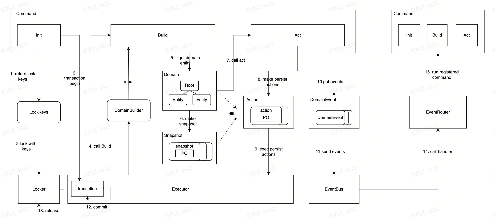

English | [中文README](README.zh_CN.md)

# Overview

DDD Firework is a framework that supports the implementation of DDD (Domain-Driven Design). It provides a complete lifecycle wrapper for domain entities, including creation, modification, persistence, event sending, event listening, and integration with components such as locks, databases, and eventbuses.

# Features

1. Providing a unified application-level interface ICommand to encapsulate the entire lifecycle (build, behavior, persistence, event sending, etc.) management of domain layer entities.
2. Automatic detection of changes to domain entities and persistence, without the need for users to handle complex storage logic.
3. Support for rapid rebuild of complex aggregations (multiple levels of entity combinations), without the need to write specific query statements.
4. Support for domain events, including domain event sending, registration of listener functions, and event callbacks.
5. Hexagonal architecture with abstract definitions of each underlying component (locks, persistence, event buses, etc.) allows for flexible pluggable components.

# Architecture

# Usage

1. Define domain entities
        
    
        import ddd "github.com/bytedance/dddfirework"

        type Order struct {
            ddd.BaseEntity
        
            UserID      string
            TotalAmount int64
            Remark      string
        }

2. Register persistence models

        import ddd "github.com/bytedance/dddfirework"
        import "github.com/bytedance/dddfirework/executor/mysql"
        
        func init() {
            mysql.RegisterEntity2Model(&domain.Order{}, func(entity, parent ddd.IEntity, op ddd.OpType) (mysql.IModel, error) {
                do := entity.(*domain.Order)
                return &po.OrderPO{
                    ID:          do.GetID(),
                    User:        do.UserID,
                    TotalAmount: do.TotalAmount,
                    Remark:      do.Remark,
                }, nil
            }, func(m mysql.IModel, do ddd.IEntity) error {
                orderPO, order := m.(*po.OrderPO), do.(*domain.Order)
                order.UserID = orderPO.User
                order.TotalAmount = orderPO.TotalAmount
                order.Remark = orderPO.Remark
                return nil
            }
        }

3. Define Command

        type UpdateOrderOpt struct {
            Remark *string
        }
        
        type UpdateOrderCommand struct {
            ddd.Command
        
            orderID string
            opt     UpdateOrderOpt
        }
        
        func NewUpdateOrderCommand(orderID string, opt UpdateOrderOpt) *UpdateOrderCommand {
            return &UpdateOrderCommand{
                orderID: orderID,
                opt:     opt,
            }
        }
        
        func (c *UpdateOrderCommand) Init(ctx context.Context) (lockIDs []string, err error) {
            return []string{c.orderID}, nil
        }
        
        func (c *UpdateOrderCommand) Build(ctx context.Context, builder dddfirework.DomainBuilder) (roots []dddfirework.IEntity, err error) {
            order := &domain.Order{
                ID:      id,
                Items:   []*domain.SaleItem{},
                Coupons: []*domain.Coupon{},
            }
            if err := builder.Build(ctx, order, &order.Items, &order.Coupons); err != nil {
                return nil, err
            }
            return []dddfirework.IEntity{order}, nil
        }
        
        func (c *UpdateOrderCommand) Act(ctx context.Context, container dddfirework.RootContainer, roots ...dddfirework.IEntity) error {
            order := roots[0].(*domain.Order)
            if c.opt.Remark != nil {
                order.Remark = *c.opt.Remark
                order.Dirty()
            }
        
            return nil
        }

4. Execute command
        
        import (
            ddd "github.com/bytedance/dddfirework" 
            db_executor "github.com/bytedance/dddfirework/executor/mysql"
            db_eventbus "github.com/bytedance/dddfirework/eventbus/mysql"
            db_lock "github.com/bytedance/dddfirework/lock/db"
            "gorm.io/driver/mysql"
            "gorm.io/gorm"
        )

        func main() {
            lock := db_lock.NewDBLock(db, time.Second*10)
            executor := db_executor.NewExecutor(db)
            eventBus := db_eventbus.NewEventBus("svc_example", db)
            engine := dddfirework.NewEngine(lock, executor, eventBus.Options()...)
            engine.RunCommand(ctx, command.NewUpdateOrderCommand(
                req.ID, command.UpdateOrderOpt{Remark: req.Remark},
            ))
        }

