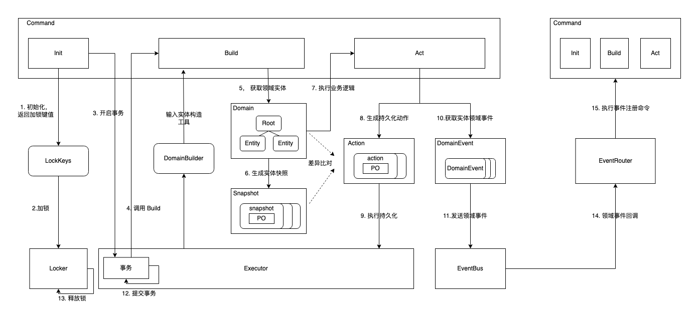

[English](README.md) | 中文README

# 关于 dddfirework

dddfirework 是一个支持 DDD （领域驱动设计）实现的引擎框架，他提供对领域实体从创建，修改，持久化，发送事件，事件监听等完整生命周期的封装，以及锁，数据库，事件总线等组件的集成。

# 特点

1. 提供统一的应用层接口 ICommand ，封装领域层实体全生命周期（构建，行为，保存，事件发送等）管理；
2. 自动发现领域实体变更，执行持久化，用户不需要处理复杂的存储逻辑;
3. 支持复杂聚合（多层级实体组合）的快速重建，不需要写具体查询语句;
4. 支持领域事件功能，包括实体发送事件，注册监听函数，事件回调等；
5. 六边形架构，对各基础组件（锁，持久化，事件总线等）抽象定义，组件可灵活插拔;

# 架构

# 用法

1. 定义领域实体
        
    
        import ddd "github.com/bytedance/dddfirework"

        type Order struct {
            ddd.BaseEntity
        
            UserID      string
            TotalAmount int64
            Remark      string
        }

2. 注册持久化模型

        import ddd "github.com/bytedance/dddfirework"
        import "github.com/bytedance/dddfirework/executor/mysql"
        
        func init() {
            mysql.RegisterEntity2Model(&domain.Order{}, func(entity, parent ddd.IEntity, op ddd.OpType) (mysql.IModel, error) {
                do := entity.(*domain.Order)
                return &po.OrderPO{
                    ID:          do.GetID(),
                    User:        do.UserID,
                    TotalAmount: do.TotalAmount,
                    Remark:      do.Remark,
                }, nil
            }, func(m mysql.IModel, do ddd.IEntity) error {
                orderPO, order := m.(*po.OrderPO), do.(*domain.Order)
                order.UserID = orderPO.User
                order.TotalAmount = orderPO.TotalAmount
                order.Remark = orderPO.Remark
                return nil
            }
        }

3. 定义命令 (Command)

        type UpdateOrderOpt struct {
            Remark *string
        }
        
        type UpdateOrderCommand struct {
            ddd.Command
        
            orderID string
            opt     UpdateOrderOpt
        }
        
        func NewUpdateOrderCommand(orderID string, opt UpdateOrderOpt) *UpdateOrderCommand {
            return &UpdateOrderCommand{
                orderID: orderID,
                opt:     opt,
            }
        }
        
        func (c *UpdateOrderCommand) Init(ctx context.Context) (lockIDs []string, err error) {
            return []string{c.orderID}, nil
        }
        
        func (c *UpdateOrderCommand) Build(ctx context.Context, builder dddfirework.DomainBuilder) (roots []dddfirework.IEntity, err error) {
            order := &domain.Order{
                ID:      id,
                Items:   []*domain.SaleItem{},
                Coupons: []*domain.Coupon{},
            }
            if err := builder.Build(ctx, order, &order.Items, &order.Coupons); err != nil {
                return nil, err
            }
            return []dddfirework.IEntity{order}, nil
        }
        
        func (c *UpdateOrderCommand) Act(ctx context.Context, container dddfirework.RootContainer, roots ...dddfirework.IEntity) error {
            order := roots[0].(*domain.Order)
            if c.opt.Remark != nil {
                order.Remark = *c.opt.Remark
                order.Dirty()
            }
        
            return nil
        }

4. 执行命令
        
        import (
            ddd "github.com/bytedance/dddfirework" 
            db_executor "github.com/bytedance/dddfirework/executor/mysql"
            db_eventbus "github.com/bytedance/dddfirework/eventbus/mysql"
            db_lock "github.com/bytedance/dddfirework/lock/db"
            "gorm.io/driver/mysql"
            "gorm.io/gorm"
        )

        func main() {
            lock := db_lock.NewDBLock(db, time.Second*10)
            executor := db_executor.NewExecutor(db)
            eventBus := db_eventbus.NewEventBus("svc_example", db)
            engine := dddfirework.NewEngine(lock, executor, eventBus.Options()...)
            engine.RunCommand(ctx, command.NewUpdateOrderCommand(
                req.ID, command.UpdateOrderOpt{Remark: req.Remark},
            ))
        }

# 更多示例

参考: [example/main.go](example/main.go)

